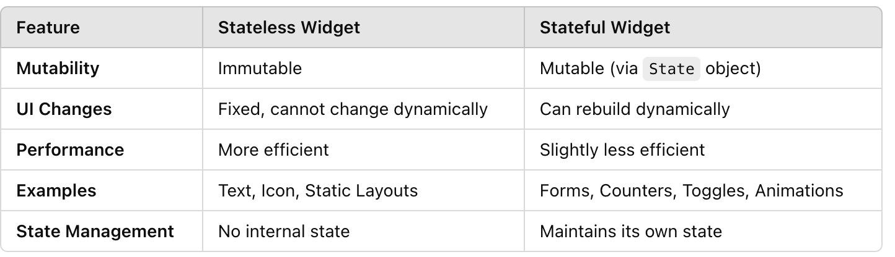

# 42KL-Specialization-Mobile-0-Basic

State v Stateless  

Stuff  
- flutter create myapp
- flutter run
- flutter clean
- r (to refresh)
- materialapp - root of the app

ex00  
- stateless widget

ex01  
- stateful widget 
- to change the state of the widget
- right click on the "statelessWidget" text, choose "refactor" to convert to statefulWidget - WOW so convenient !!
- add changeText function in the onPressed function

ex02  
- Add (wrap) row widget to display 0 row
- Add column widget with 2 row widgets inside it 

Resources:
- https://www.youtube.com/watch?v=8sAyPDLorek&t=3635s
- https://docs.flutter.dev/cookbook 
